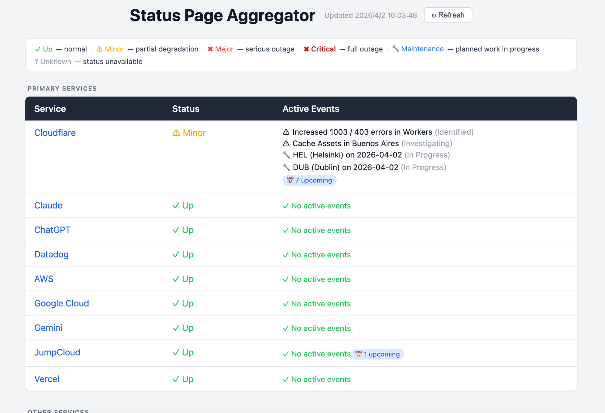

# Status Page Aggregator

[English](README.md)

将多个服务的状态页聚合到同一个视图的轻量级仪表板。后端使用 Ruby/Sinatra，前端使用原生 JavaScript，无重量级框架，无外部 CDN 依赖。



## 功能特性

- **分级监控** — 主要服务（必须关注）与次要服务分区展示
- **多种 API 适配器** — 开箱即用支持 Atlassian Statuspage、Google Cloud 和 AWS（RSS）
- **活跃事件明细** — 展示进行中的故障和维护；计划中的维护以数字徽章显示
- **按严重程度排序** — 状态最差的服务自动排在最前面
- **状态图例** — 页面颜色编码指示器，一眼看清整体状况
- **手动刷新** — 刷新按钮附带最后更新时间；同时每 60 秒自动刷新
- **Docker 优先** — 单容器运行，无外部依赖

## 状态指示器

| 指示器 | 含义 |
|--------|------|
| ✓ Up | 所有系统正常 |
| ⚠ Minor | 部分降级 |
| ✖ Major | 严重故障 |
| ✖ Critical | 完全中断 |
| 🔧 Maintenance | 计划维护进行中 |
| ? Unknown | 状态不可用 |

## Docker 运行

```bash
docker build -t status-page-aggregator .
docker run -d -p 9292:9292 --name status-page-aggregator status-page-aggregator
```

打开浏览器访问 `http://localhost:9292`。

## 配置

编辑 `config/status_pages.yml` 来添加或移除服务。服务分为 `primary`（主要）和 `secondary`（次要）两个层级。

```yaml
primary:
  MyService:
    url: https://status.myservice.com
    type: atlassian        # atlassian | google_cloud | aws

secondary:
  AnotherService:
    url: https://status.anotherservice.com
    type: atlassian
```

### 支持的 API 类型

| 类型 | 用于 | 工作方式 |
|------|------|----------|
| `atlassian` | 任意 Atlassian Statuspage | 调用 `/api/v2/summary.json` |
| `google_cloud` | Google Cloud、Gemini | 调用 `/incidents.json`；添加 `filter: gemini` 可只显示 Gemini/Vertex AI 相关故障 |
| `aws` | AWS | 解析 `status.aws.amazon.com` 的公开 RSS feed；从每条条目中提取受影响的区域 |

### 已知限制

| 服务 | 状态 | 说明 |
|------|------|------|
| CrowdStrike | 暂不支持 | 截至 2026-03 尚无公开状态页，待官方发布后添加。 |

### 添加新服务（Atlassian 类型）

找到该服务状态页的根 URL（如 `https://www.githubstatus.com`），添加到对应层级：

```yaml
secondary:
  GitHub:
    url: https://www.githubstatus.com
    type: atlassian
```

## 本地运行（不使用 Docker）

需要 Ruby 3.2+ 和 Bundler。

```bash
bundle install
bundle exec rackup -p 9292
```

## License

MIT
